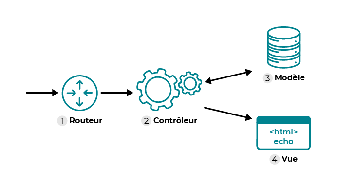

# Qu'est-ce qu'un routeur

Dans une application web, un routeur joue un rôle essentiel dans la gestion des requêtes HTTP entrantes et le routage vers les gestionnaires de ces requêtes. Voici les principaux aspects du rôle d'un routeur dans une application web :

- Gestion des routes: le routeur associe des URL spécifiques à des fonctions ou des gestionnaires de requêtes appropriés. Cela permet de définir comment l'application doit répondre à chaque URL demandée par le client.

- Modularité: le routeur permet de diviser l'application en modules ou en sections logiques. Chaque module peut avoir son propre ensemble de routes et de gestionnaires de requêtes, ce qui facilite la gestion des fonctionnalités distinctes de l'application.

- Organisation du code: en structurant les routes dans des modules distincts, le routeur contribue à rendre le code plus organisé et plus facile à gérer, en particulier pour les applications de grande taille.

- Réutilisabilité du code: les routes et les gestionnaires de requêtes définis dans un routeur peuvent être réutilisés à plusieurs endroits de l'application, ce qui favorise la réutilisabilité du code et réduit la duplication.

- Gestion des erreurs: les routeurs peuvent également inclure des gestionnaires d'erreurs spécifiques qui sont activés lorsque des erreurs se produisent lors du traitement des requêtes. Cela permet de gérer les erreurs de manière centralisée et spécifique à chaque module ou section de l'application.

- Middleware: les routeurs peuvent utiliser des middlewares pour effectuer des opérations de prétraitement ou de post-traitement sur les requêtes avant ou après qu'elles atteignent les gestionnaires de requêtes. Cela permet d'ajouter des fonctionnalités communes à plusieurs routes sans avoir à les répéter pour chaque route individuelle.

En résumé, le routeur dans une application web joue un rôle crucial dans la gestion des routes, la modularité, l'organisation du code, la réutilisabilité du code, la gestion des erreurs et l'utilisation de middlewares. Il contribue à rendre l'application plus structurée, plus facile à développer et plus simple à maintenir.

*Schéma de gestion des routes dans une application internet - Le routeur dispatche les requêtes en fonction des url et détermine quel est le contrôleur approprié pour les gérer.*

# Création d'un routeur en PHP
