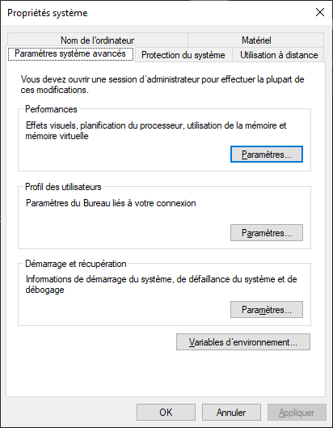
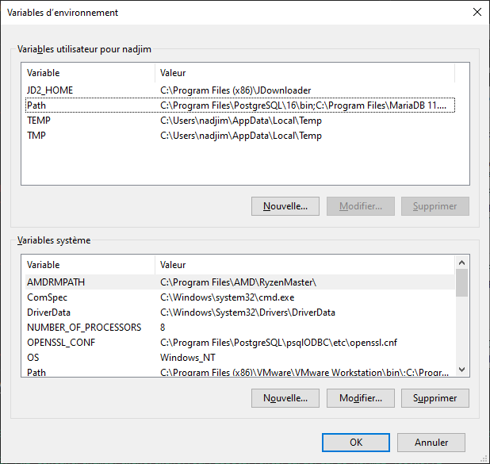
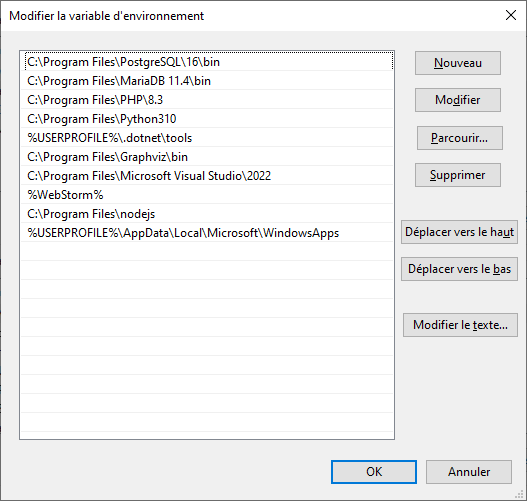
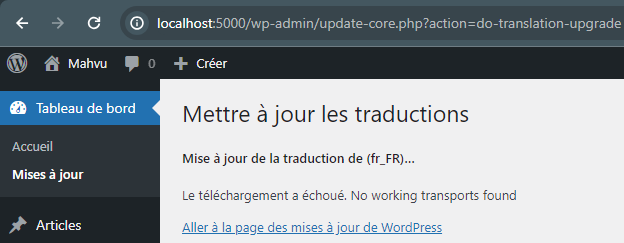

# 1. Installation de PHP
- Télécharger l'archive zip
- Décompresser l'archive dans le répertoire désiré

# 2. Installation de MariaDB

# 3. Préparation de Windows

- ajoutez les répértoires de PHP et Maria dans le PATH

  
  
  

# 4. Préparation de PHP

Lors de l'installation de WordPress, plusieurs erreurs successives vont apparaître. Nous allons régler les problèmes avant qu'ils arrivent.

## 4.1 Erreurs rencontrées lors de l'installation de WORDPRESS


> Il semble que votre installation PHP ne possède pas l’extension MySQL nécessaire pour WordPress.
> Veuillez vérifier que l’extension PHP mysqli est installée et activée.

- Activer l'extension mysqli :

  Ouvrez le fichier php.ini avec un éditeur de texte comme Notepad.

  Recherchez la ligne suivante :

  ```;extension=mysqli```

  Supprimez le point-virgule ; au début de la ligne pour décommenter l'extension :

  ```extension=mysqli```

  Vérifiez l'existence du répertoire ext, et vérifiez qu'il contienne bien l'extension php_mysqli.dll

  Ensuite il faut déterminer le dossier qui contient l'extension dans le fichier php.ini

  Recherchez les lignes suivantes

  ```
  ; On windows:
  ; extension_dir = "ext"
  ```

  Et décommenteez la ligne ```; extension_dir = "ext"``` en supprimant le point virgule

  ```extension_dir = "ext"```


- Le téléchargement a échoué. No working transports found



Et décommenteez la ligne ```; extension=openssl"``` en supprimant le point virgule

```extension=openssl```

