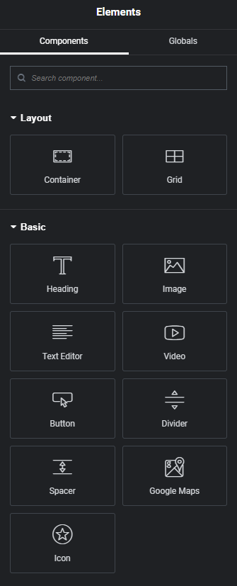

# Compositeur de page

Le compositeur permet d'éditer des pages en ajoutant et retirant facilement des composants.
Un panneau latéral permet d'ajouter des composants à la page. Il est découpé en plusieurs parties :
- layout pour structurer la page. Il permet d'ajouter des contenuers simple ou des conteneurs de forme grilles. Ces conteneurs pourront à leur tour accueillir d'autres conteneurs ou des composants.
- basic qui correspond à des éléments HTML classiques.
- 

Permet de composer une page en temps réel et de façon visuelle

Composants disponibles
- conteneurs (classiques, ou grilles)
- images
- listes
- tableaux
- boutons
- caroussels
- Avant / Après
